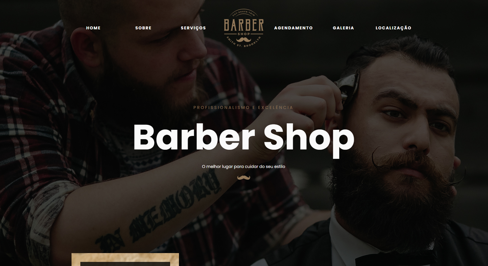
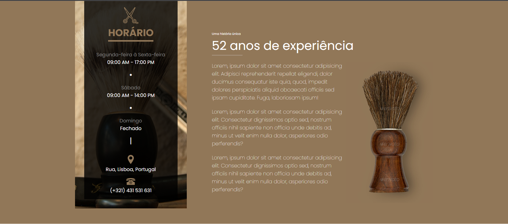
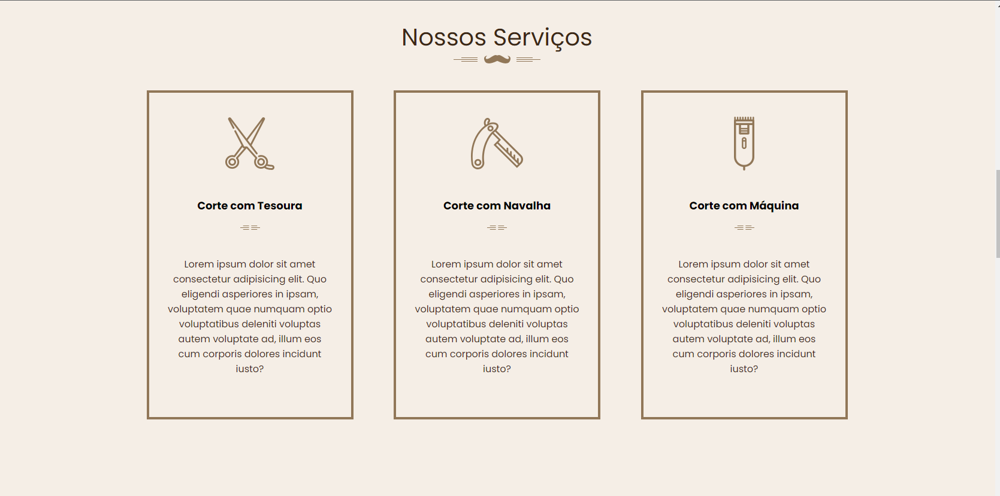
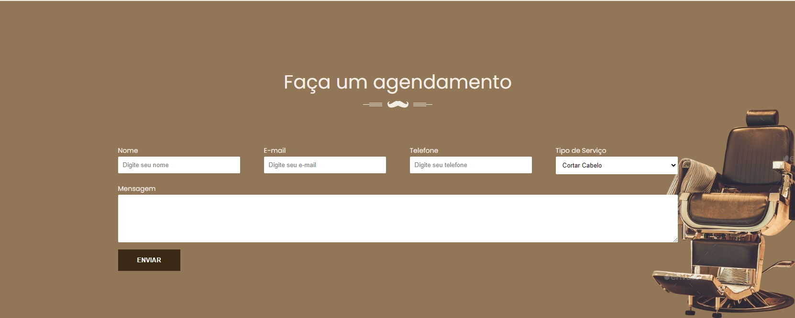
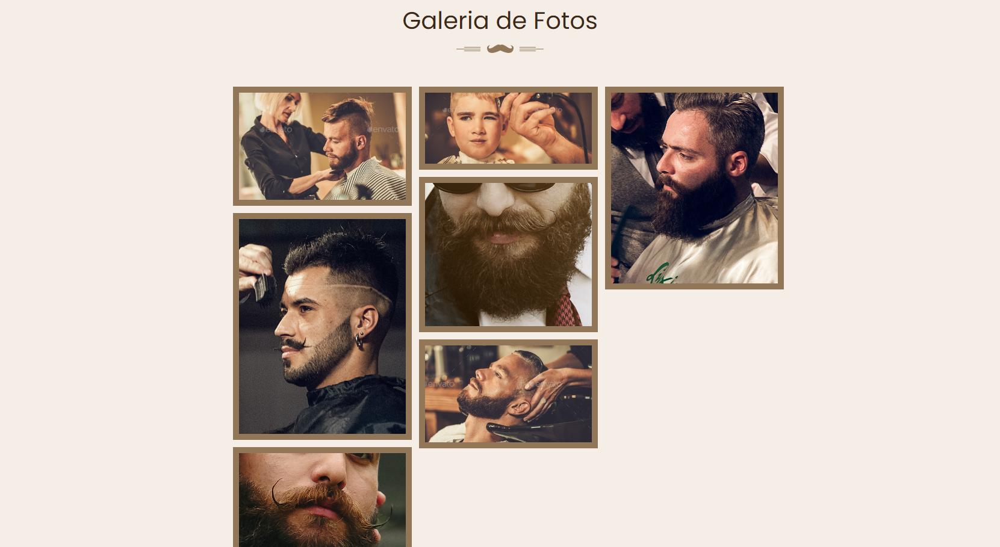
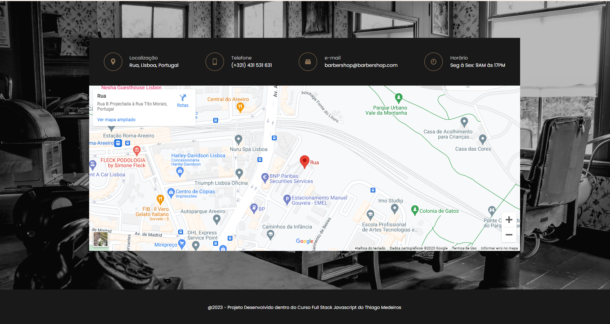

# BarberShop_v1
Projeto Desenvolvido no Curso Full Stack do Thiago Medeiros

# O que aprendi nesse projeto
Esse foi meu primeiro projeto com desafios reais, apesar de ser uma lading page do Curso, eu refiz ela inteira sozinha aplicando os conhecimentos de HTML, CSS e usando muito o flex box.

